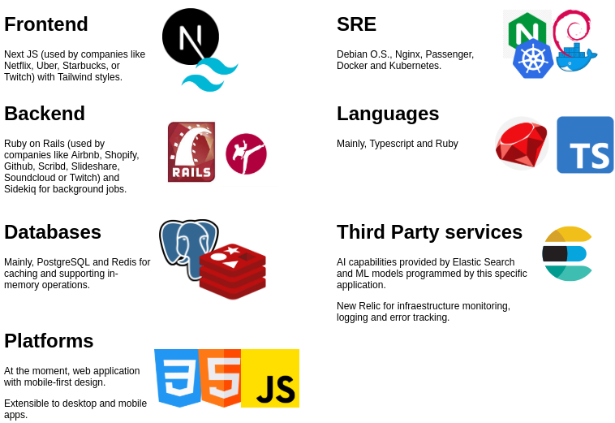

# 2. First approach

[Back to home](../README.md) | [3 - Case diagrams](.)

## Our metodology

We develop software solutions with agile metodology. First, we need to define scope and requirements of the project and then we can proceed to development planning.

Usually, we develop in six weeks cicles and then we take two weeks to analyse the job done and define the next development cycle.

For us, is essential to have a MVP (minimum viable product) delivered even from the first development cycle. For you, that means a first version of your product totally functional with the basic features ready to use (IN SIX WEEKS).

Working in this way, after each delivery, we have two weeks to analyse the product with you and your users and planning potential improvements. In our experience, it's very frequent that users don't use some very complex features and prefer to use other things that we considered a "secondary" at first look. Fortunately, we don't need wait a year or six months to take other path or maybe give more value to those "secondary things" that are awesome for your users. *We could do that in the next six weeks development cicle*.

## Tech stack

We propose to use the following technology stack. It ensures scaling posibilities and fast developments cycles. Plus, we love using modern and super powerful technologies.

## Preliminar models

This is a simplified version of full class diagram. Methods, attributes and encapsulated objects are not shown here.

### Relations

[Click here](2-1-relations.md)

## Preliminar views

A first fast estimation is that is necessary build a CRUD for 12 resources. So, we need at least 48 views.

## Team

We suggest a team composed by:

- [Project manager (part-time)](https://www.linkedin.com/in/david-cejas/).
- UI designer.
- SRE specialist.
- [Sr. Frontend Developer](https://www.linkedin.com/in/ignacio-agust%C3%ADn-grassini-75113b150/).
- [Sr. Backend Developer](https://www.linkedin.com/in/juanmamaffei/).
- [Sr. QA/QC Engineer (part-time)](https://www.linkedin.com/in/valeriagrassini).

## Time estimation for deploy a MVP

Rough estimations of time, complexity and budget.

- First six weeks cicle: BASIC and functional MVP.
- Two weeks cool down.
- Second six weeks cicle: COMPLETE MVP, fix bugs.
- Two weeks cool down.
- Third six weeks cicle: Adding features (like IA, login with social media and other requirements arisen in cool down cicles).
- Two weeks cool down: Review next steps (scalability, new features, general balance).

*Total duration:* 24 weeks (6 months) with a total functional first product since second month.

- *Our work*: 2100 hours of team work. This have an approximate cost of US$ 52500.
- *Other expenses not contemplated*:
  - Legal (privacy, terms and conditions contracts).
  - Third-party licences (ElasticSearch and New Relic).
  - Domains, SSL.
  - Server infraestructure leasing (API, databases, web frontend, notifications).

[//]: # (TASKS)
[//]: # (Review entire logic. BE+FE - 20)
[//]: # (Design API. BE - 100)
[//]: # (Write stories. PM - 15)
[//]: # (Sketch UI. UI - 100)
[//]: # (Create components. FE - 100)
[//]: # (Mounting infraestructure. SRE - 100)
[//]: # (First deploy. SRE - 100)
[//]: # (565 hours)

[//]: # (Nacho: 500 horas, Tano: 500 horas, Juanma: 500 horas)
