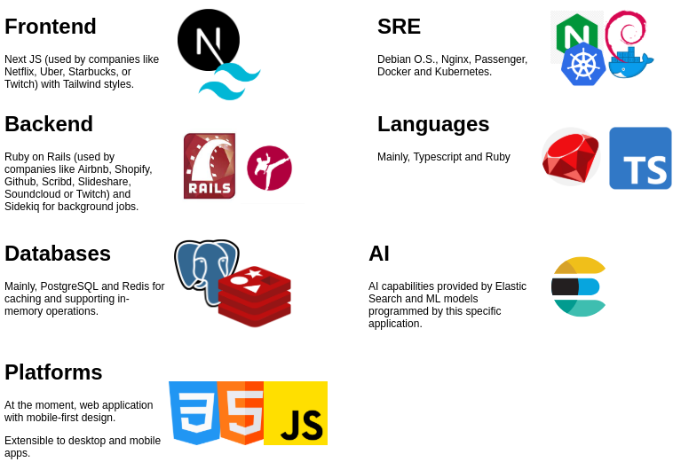

# 2. First approach

[Back to home](../README.md) | [3 - Case diagrams](.)

## Tech stack

## Preliminary models

This is a simplified version of full class diagram. Methods, attributes and encapsulated objects are not shown here.

